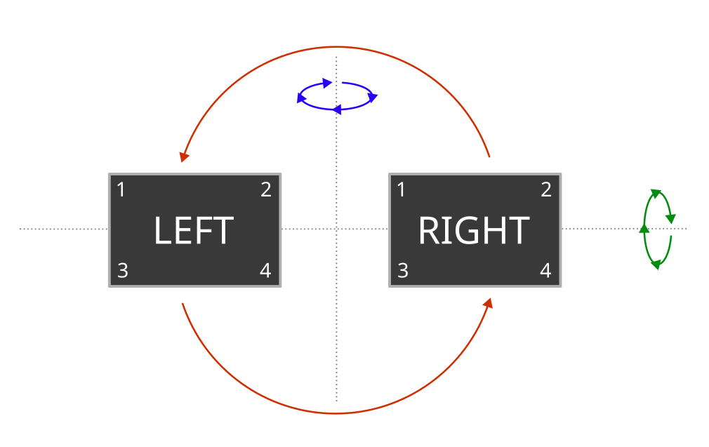
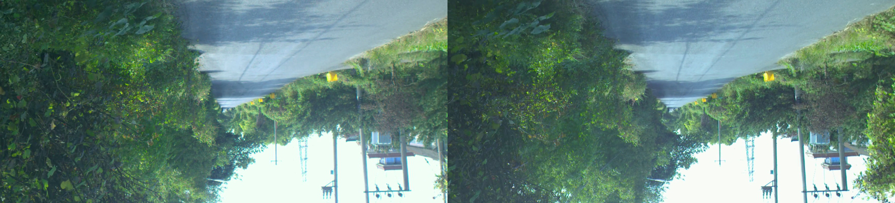
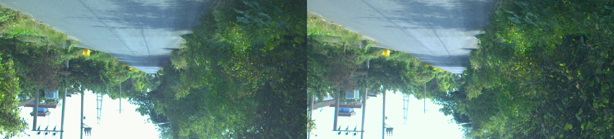

# Weather prediction from stereo images
### Project 2 in INF367A : Topological Deep Learning
**Odin Hoff Gardå, April 2023**

## Scope of this project 

In this project, we will compare the performance of the following three models:
- A standard off-the-shelf convolutional neural network (**CNN**), 
- a convolutional neural network with smoothing (**SmoothCNN**) and 
- a group equivariant convolutional neural network (**GCNN**).

The learning objective for all models is to predict weather condition (cloudy or sunny) from a stereo image as input. In other words, we are solving a binary regression problem. We report cross entropy loss (also known as log loss) and classification accuracies on the training, validation and test dataset.

## Dataset

The dataset consists of 1000 stereo images each consisting of one left and one right image. Each image has 3 channels (RGB) with resolution 879x400 (WxH). The possible label values are 'cloudy' (0) and 'sunny' (1). The dataset is perfectly balanced with 500 samples of each label.

**Figure:** Two images (index 2 and 3) from the dataset (left and right view) with labels 'sunny' and 'cloudy'.

**Note:** The two cameras used were mounted on top of a car, with one in the center and one on the right hand side, 54 cm apart. Still, we will call the center and right images the *left view* and the *right view*, respectively.

## Symmetries

### Dihedral group $D_2$

The symmetry group of a (non-square) rectangle is the dihedral group $D_2$, isomorphic to the Klein four-group $\mathbb{Z}_2\times\mathbb{Z}_2$. Geometrically, the group $D_2$ can be described by the following symmetries:
- $e$: rotation by 0 (identity),
- $r$: rotation by $\pi$,
- $m_h$: mirroring along the horizontal axis, and
- $m_v$: mirroring along the vertical axis.

|$D_2$|$e$|$r$|$m_h$|$m_v$|
|:---|:---:|:---:|:---:|:---:|
|$e$|$e$|$r$|$m_h$|$m_v$|
|$r$|$r$|$e$|$m_v$|$m_h$|
|$m_h$|$m_h$|$m_v$|$e$|$r$|
|$m_v$|$m_v$|$m_h$|$r$|$e$|

**Table:** The Cayley table of $D_2$. The group is generated by the two elements $m_h$ and $m_v$.

We could let two copies of $D_2$ act on the left and right views independently. In that case, we would have been working with the group $D_2\times D_2\equiv \mathbb{Z}_2^4$ of order $16$. But, as the left and right views are physically coupled in the real-world, we choose to continue with a single copy of $D_2$ acting on our images as shown in the following figure:

**Figure:** We have three non-trivial $D_2$-actions on a stereo image. One rotation shown in red, and two mirror symmetries. The mirror symmetries around the vertical and horizontal axes are shown in blue and green, respectively.

In practice, both views are combined by stacking them horizontally, giving us a single image of size 1758x400 (WxH). The $D_2$ group actions are simply implemented using `torch.flip()` and also supports mini-batches.

|Group actions visualized|
|---|
||
|Original: $e\cdot x$|
||
|Rotated CCW by $\pi$ radians: $r\cdot x$|
||
|Mirrored around the horizontal axis: $m_h\cdot x$|
||
|Mirrored around the vertical axis: $m_v\cdot x$|
