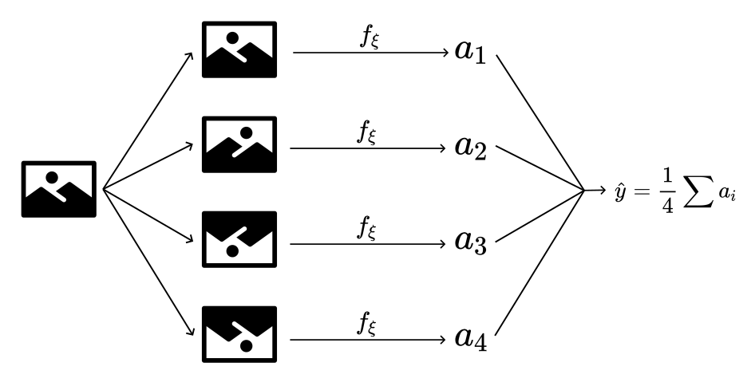
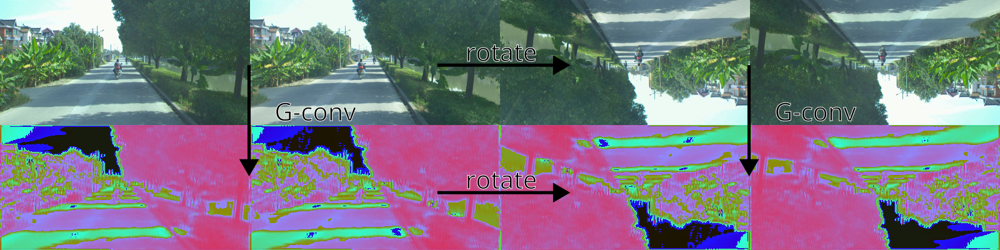
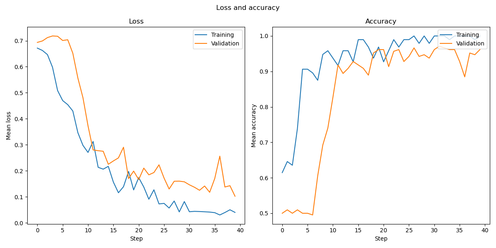
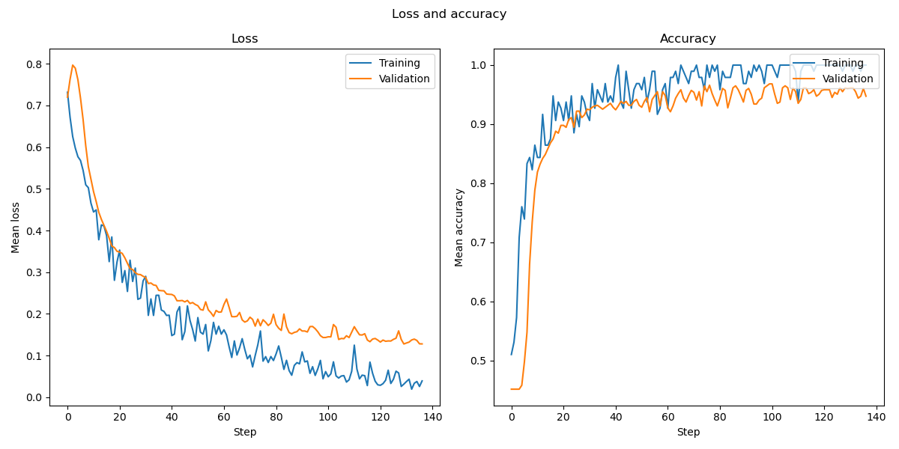
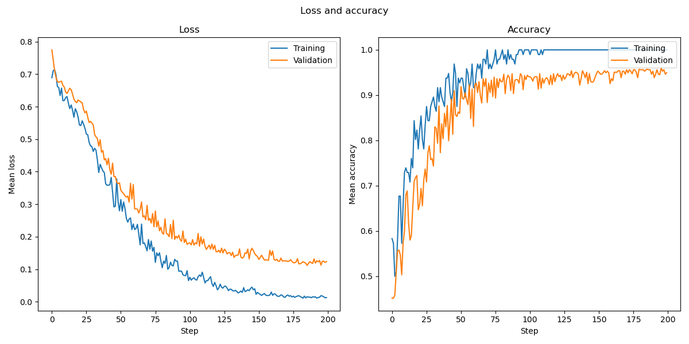

# Weather prediction from stereo images
### Project 2 in INF367A : Topological Deep Learning
**Odin Hoff Gardå, April 2023**

## Scope of this project 

In this project, we will compare the performance of the following three models:
- A standard off-the-shelf convolutional neural network (**CNN**), 
- a convolutional neural network with averaged/smoothed output (**SmoothCNN**) and 
- a group equivariant convolutional neural network (**GCNN**).

The learning objective for all models is to predict weather condition (cloudy or sunny) from a stereo image as input. In other words, we are solving a binary regression problem. We report cross entropy loss (also known as log loss) and classification accuracies on the training, validation and test dataset.

Given a set of symmetries acting on our input image, it is often reasonable to wish for invariance under this action. For example, a rotated version of an image should give the same prediction as the original image. Often, we try to solve this by using data augmentation. However, training with augmented data does not guarantee invariance. Also, it is costly both in terms of time and the amount of data needed to approximate invariance with augmentation. Therefore, if we a priori know which symmetries we want our network to be invariant under, it is a better idea to design the network to have this property built-in. We aim to achieve this by using group equivariant convolutional layers followed by some permutation invariant operation (e.g., min, max, sum or arithmetic mean).

## Dataset

The dataset consists of 1000 stereo images each consisting of one left and one right image. Each image has 3 channels (RGB) with resolution 879x400 (WxH). The possible label values are 'cloudy' (0) and 'sunny' (1). The dataset is perfectly balanced with 500 samples of each label.


**Figure:** Two images (index 2 and 3) from the dataset (left and right view) with labels 'sunny' and 'cloudy'.

**Note:** The two cameras used were mounted on top of a car, with one in the center and one on the right hand side, 54 cm apart. Still, we will call the center and right images the *left view* and the *right view*, respectively.

In practice, each view is resized to 400x200 (WxH) to reduce memory requirements and to speed up loading data to GPU. The data loader returns tensors of shape $(B,3,2,200,400)$ where $B$ is the chosen batch size (default: 16). We split the 1000 stereo images into training (400 images), validation (300 images) and test data (300 images). Means and standard deviations are pre-computed (pixel-wise for each view) on the training dataset, and used for normalization. The actual implementation can be found in `utils/dataloader.py`.

## Symmetries

### Dihedral group $D_2$

The symmetry group of a (non-square) rectangle is the dihedral group $D_2$, isomorphic to the Klein four-group (also known as the Vierergruppe) $\mathbb{Z}_2\times\mathbb{Z}_2$. Geometrically, the group $D_2$ can be described by the following symmetries:
- $e$: rotation by 0 (identity),
- $r$: rotation by $\pi$,
- $m_h$: mirroring along the horizontal axis, and
- $m_v$: mirroring along the vertical axis.


|$D_2$|$e$|$r$|$m_h$|$m_v$|
|:---|:---:|:---:|:---:|:---:|
|$e$|$e$|$r$|$m_h$|$m_v$|
|$r$|$r$|$e$|$m_v$|$m_h$|
|$m_h$|$m_h$|$m_v$|$e$|$r$|
|$m_v$|$m_v$|$m_h$|$r$|$e$|

**Table:** The Cayley table of $D_2$. The group is generated by the two elements $m_h$ and $m_v$.

We could let two copies of $D_2$ act on the left and right views independently. In that case, we would have been working with the group $D_2\times D_2\equiv \mathbb{Z}_2^4$ of order $16$. But, as the left and right views are physically coupled in the real-world, we choose to continue with a single copy of $D_2$ acting on our images as illustrated in the following figure:


**Figure:** We have three non-trivial $D_2$-actions on a stereo image. One rotation shown in red, and two mirror symmetries. The mirror symmetries around the vertical and horizontal axes are shown in blue and green, respectively.

|Group actions visualized|
|---|
||
|**Figure:** Trivial group action, $e\cdot x$.|
||
|**Figure:** Rotation by $\pi$ CCW, $r\cdot x$.|
||
|**Figure:** Mirroring around the horizontal axis, $m_h\cdot x$.|
||
|**Figure:** Mirroring around the vertical axis, $m_v\cdot x$.|

The actual implementation of the group actions can be found in `utils/group.py`. The functions and the relations between them are then given to the `Group` class constructor as a list of functions and a Cayley table, respectively. The group equivariant layers then take an instance of the `Group` class as the first argument.

**Remark:** In the first implementation, the two views were stacked side-by-side and treated as a single rectangle with the natural $D_2$-action. However, this does not make sense when considering translations. This is the reason both views are treated separately.

## Stereo images as signals on $\Omega$

We now give a more theoretical perspective on the action of $D_2$ on the stereo images. 

Let $h,w\in\mathbb{N}$, set $I=\mathbb{Z}_H\times\mathbb{Z}_W$ and write $\Omega=I^2\simeq\mathbb{Z}_H\times\mathbb{Z}_W\times\mathbb{Z}_H\times\mathbb{Z}_W$. We can view a single (RGB) stereo image as a function $\omega\colon\Omega\to\mathbb{R}^3$. We call such functions signals on the domain $\Omega$ and denote the vector space of all such functions by $\mathcal{X}(\Omega, \mathbb{R}^3)$.

### Group action of $D_2$ on $\Omega$
Let $p=(a,b,c,d)$ be an element of $\Omega$ and define the group action

$$
D_2\times\Omega\to\Omega
$$

$$
(g, p)\mapsto g\cdot p
$$

on the generators $m_v$ and $m_h$ by letting $m_v\cdot p = (a,W-b, c,W-d)$ and $m_h\cdot p = (H-c, d, H-a, b)$. We then get that $r\cdot p = (H-c, W-d, H-a,W-b)$ and $e\cdot p = p$ by extending the above map to a group action.

### Lifting the group action to signals
We lift the $D_2$-action on $\Omega$ to a $D_2$-action on $\mathcal{X}(\Omega)$ as follows:

$$
\psi\colon D_2\times\mathcal{X}(\Omega)\to\mathcal{X}(\Omega)
$$

$$
(g,x)\mapsto \left[g\cdot x\colon p\mapsto x(g^{-1}\cdot p)\right].
$$

Since in $D_2$, every element is its own inverse, we simply have that $g\cdot x(p)=x(g\cdot p)$. 

**Note:** The map $D_2\to\operatorname{Aut} \mathcal{X}(\Omega)$ defined by $g\mapsto \psi(g, -)$ is nothing but the (left) regular representation of $D_2$ on the vector space $\mathcal{X}(\Omega)$.

In practice, a stereo image is represented by a tensor of shape $(3,2,H,W)$, and the symmtries are implemented as functions acting on the last three dimensions using indexing and the built-in `torch.flip()` function. The group acts in exactly the same way on stereo feature maps and weights (kernels).

## Model descriptions

### CNN

The CNN model is more or less a standard CNN network. The only difference is that we treat the two views, left and right, separately when performing convolution, pooling and batch normalization. In other words, the right and left views have their own set of weights and biases. Convolution, max pooling and batch normalization layers for stereo images are implemented in `models/stereoconv.py`. We use circular padding on each view (wrapping around in both directions). The implementation of the CNN model can be found in `models/cnn.py`.

It is well-known and not hard to see that the convolutional layers are equivariant under translations. The idea for the SmoothCNN model is to force the CNN model to be invariant under symmetries as well. In the GCNN model, we build $G$-equivariant layers and force invariance later in the network.

The CNN model has 28637 learnable parameters and consists of the following layers:

```
Layer (type:depth-idx)                        Param #
======================================================================
CNNModel                                      --
├─Sequential: 1-1                             --
│    └─StereoConvBlock: 2-1                   --
│    │    └─Sequential: 3-1                   1,920
│    └─StereoMaxPool2d: 2-2                   --
│    └─StereoConvBlock: 2-3                   --
│    │    └─Sequential: 3-2                   9,312
│    └─StereoMaxPool2d: 2-4                   --
│    └─StereoConvBlock: 2-5                   --
│    │    └─Sequential: 3-3                   4,704
│    └─StereoConvBlock: 2-6                   --
│    │    └─Sequential: 3-4                   2,352
│    └─StereoConvBlock: 2-7                   --
│    │    └─Sequential: 3-5                   1,200
│    └─StereoMaxPool2d: 2-8                   --
│    └─StereoConvBlock: 2-9                   --
│    │    └─Sequential: 3-6                   600
│    └─StereoMaxPool2d: 2-10                  --
│    └─StereoConvBlock: 2-11                  --
│    │    └─Sequential: 3-7                   312
│    └─StereoConvBlock: 2-12                  --
│    │    └─Sequential: 3-8                   156
├─Sequential: 1-2                             --
│    └─Linear: 2-13                           8,040
│    └─Linear: 2-14                           41
│    └─Sigmoid: 2-15                          --
======================================================================
```

### SmoothCNN

We now describe the most naive approach to achieving a (non-trivial) $G$-invariant network. In general, for a (locally compact) group $G$, we can smooth $f_\xi$ by integrating over $G$ with respect to the Haar measure on $G$. In our case, where $G$ is finite (or more generally, discrete), the Haar measure on $G$ is just the counting measure. Given a finite group $G$ acting on the space of signals, and a network $f_\xi\colon\mathcal{X}(\Omega)\to\mathbb{R}$, define the *smoothed version* of $f_\xi$, denoted by $\bar{f_\xi}$ by letting $\bar{f_\xi}(x)=\frac{1}{|G|}\sum_{\tau\in G}f(gx)$. For any $\sigma\in G$ we easily see that $\bar{f_\xi}(\sigma x) = \frac{1}{|G|}\sum_{\tau\in G}f_\xi(\tau\sigma x) = \frac{1}{|G|}\sum_{\tau\in G}f_\xi(\tau x)=\bar{f_\xi}(x)$ showing that the smoothed network is $G$-invariant.


**Figure:** A diagram showing the SmoothCNN model. The function $f_\xi$ denotes the CNN model. (The "photo" icon is from www.flaticon.com by the user Freepik.)

The SmoothCNN model is just the CNN model with a modified `forward()` method averaging the output probabilities over all transformed version of a stereo image. The implementation can be found in `models/smoothcnn.py`.

### GCNN

We will now discuss the group equivariant convolutional neural network. Implementations of the different layers mentioned below can be found in `models/groupconv.py` and the final model can be found in `models/gcnn.py`.

#### Lifting convolution

The first layer in our group equivariant convolutional neural network is often called the *lifting convolution* and takes a signal on $\Omega$ to a signal on the affine group $G:=D_2\ltimes\Omega$. Let $C$ be the number of out channels and $\psi$ be a filter, i.e, another signal on $\Omega$. The lifting convolution is then defined as follows:

$$
\begin{align*}
\mathcal{X}(\Omega,\mathbb{R}^3)&\to\mathcal{X}(G,\mathbb{R}^{C})\\
x&\mapsto x\star\psi
\end{align*}
$$

where 

$$
x\star\psi(g)=\sum_{p\in\Omega}\sum_{k=1}^{3}x^k(p)\psi^k(g^{-1}p)$.
$$

In practice, we have more than one feature map (out channel). The definition is the same, but with an additional variable indexing the out channels.

The lifting convolutional layer is $G$-equivariant. That is, $((h\cdot x)\star\psi)(g) = (h\cdot(x\star\psi))(g)$.

In practice, the lifting convolution is implemented by performing normal convolution with all transformed versions of the filter $\psi$. This adds a "group dimension" to the output signal. If the input shape is $(C,2,H,W)$, then the output shape is $(4,C,2,H,W)$ where the $4$ is the order of the symmetry group $D_2$.

#### Group convolution

Once our stereo images (signals on $\Omega$) are lifted to signals on $G$ we can perform group convolution. Group convolution is a $G$-equivariant operator $\mathcal{X}(G,\mathbb{R}^C)\to\mathcal{X}(G,\mathbb{R}^{C'})$ mapping a signal $x$ on $G$ to the convolution (or correlation) 
$$
x\star\psi(g)=\sum_{p\in G}\sum_{k=1}^{C}x^k(p)\psi^k(g^{-1}p).
$$

Note that since $p$ now ranges over $G$, not only $\Omega$, we are not only moving the filter in the horizontal and vertical dimensions, but also in the group dimension. This makes the group convolutional layer $G$-equivariant.

#### Batch normalization and pooling

Batch normalization is done in a similar way to the case of stereo images. However, we only have one scale and one bias parameter for each $G$-feature map. This makes batch normalization $G$-invariant as noted in the paper by Cohen and Welling. Max pooling is done separately for each  $G$-feature map.

We also have a group pooling layer which compute the average (or sum/min/max) over the group dimension. This layer can also be set to average over all transformed versions of the input to force a $G$-invariant output. This is done right before the last fully connected layers. In this way, we preserve $G$-equivariance almost through the entire network.

#### Equivariance illustrated


**Figure:** A simple $G$-equivariant model consisting of one lifting convolutional layer followed by two $G$-convolutional layers. The weights were randomly initialized. Top left: original stereo image. Top right: rotated stereo image. Bottom left: output of the model with the original image as input. Bottom right: output of the model with the rotated image as input. Observe that the output of the rotated image is a rotated version of the output of the original image. In other words, this demonstrates the equivariance of the model.

#### Model specifications

The GCNN model has 28121 learnable parameters and consists of the following layers:

```
Layer (type:depth-idx)                        Param #    
======================================================================
GCNNModel                                     -- 
├─Sequential: 1-1                    		  --
│    └─StereoZ2ConvG: 2-1 					  872
│    └─StereoGBatchNorm2d: 2-2                16
│    │    └─GroupNorm: 3-1  				  --
│    │    └─GroupNorm: 3-2                    --
│    └─ReLU: 2-3                              --
├─Sequential: 1-2                             --
│    └─StereoGMaxPool2d: 2-4                  --
│    └─StereoGConvBlock: 2-5                  --
│    │    └─Sequential: 3-3                   9,240
│    └─StereoGConvBlock: 2-6                  --
│    │    └─Sequential: 3-4                   4,632
│    └─StereoGMaxPool2d: 2-7                  --
│    └─StereoGConvBlock: 2-8                  --
│    │    └─Sequential: 3-5                   2,328
│    └─StereoGConvBlock: 2-9                  --
│    │    └─Sequential: 3-6                   1,176
│    └─StereoGMaxPool2d: 2-10                 --
│    └─StereoGConvBlock: 2-11                 --
│    │    └─Sequential: 3-7                   1,176
│    └─StereoGConvBlock: 2-12                 --
│    │    └─Sequential: 3-8                   600
│    └─StereoGAveragePool: 2-13               --
├─Sequential: 1-3                             --
│    └─Linear: 2-14                           8,040
│    └─ReLU: 2-15                             --
│    └─Linear: 2-16                           41
│    └─Sigmoid: 2-17                          --
======================================================================
```

## Training and final results

All models were trained with the Adam optimizer (with learning rate 1e-4 and weight decay 1e-2) and a batch size of 16. Validation was performed four times every epoch and the training early stopped if there where no improvement (hysteresis set to 0.01) in validation accuracy for 20 validation steps (5 epochs).

### Loss and accuracies during training


**Figure:** Loss and accuracy for training and validation data for the CNN model. The model trained for 46 epochs before the early stopper terminated the training. The mean time used for each epoch (including validation steps) was 7.19 seconds.


**Figure:** Loss and accuracy for training and validation data for the SmoothCNN model. The model trained for 34 epochs before the early stopper terminated the training. The mean time used for each epoch (including validation steps) was 8.86 seconds.


**Figure:** Loss and accuracy for training and validation data for the GCNN model. The model trained for the maximum number of epochs set to 50 and was not terminated by the early stopper. The mean time used for each epoch (including validation steps) was 12.27 seconds.

### Accuracies on test data

The following table shows the performance of each model on the test dataset and the (mean) time spent on each epoch during training:

|Model|Test Accuracy|Mean epoch time|
|-|-|-|
|*CNN*|0.9265|**7.19s**|
|*SmoothCNN*|0.9638|8.86s|
|*GCNN*|**0.9737**|12.27|

## Concluding remarks

When using more training data, the standard CNN network easily gives a model with >99% test accuracy leaving little room for improvement. To make the task more challenging, we use only 400 images in our training dataset. Still, we only see a slight increase in test accuracies when evaluating the SmoothCNN and the GCNN models. The CNN network is also the fastest of the three models, both in training and evaluation. The SmoothCNN is a sort of all-rounder performing better than the standard CNN and being faster than the GCNN. It should be noted that there likely is room for optimizing the implementation of the group equivariant layers.

It would be interesting to compare the models on an even more challenging task such as predicting depth maps from the stereo images. Another task we could test is the rotated (and/or mirrored) MNIST dataset. Even though the handwritten digit six is a transformed version of the digit nine, it would be interesting to see if the GCNN could differentiate them based subtle differences in how we (humans) write the different digits.

Of course, there is room for experimentation when it comes to architecture and hyper-parameters. Since the sum of two equivariant layers is equivariant, we can also create residual blocks allowing for deeper networks by reducing the risk of vanishing gradients. We could also try to train the standard CNN model with data augmentation and compare to the GCNN model.

The code provided for the GCNN network can easily be modified to work with other finite groups and regular images.
